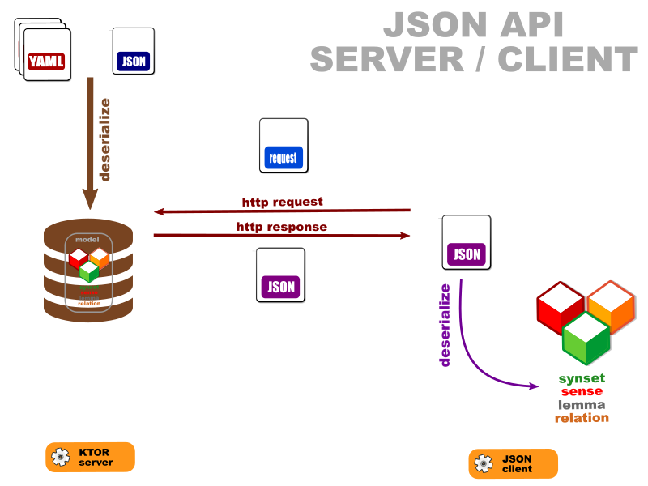

# OEWN JSON client

This is a sketch of what a useful client to the JSON API will do.

This emits requests and reads JSON responses.

Inputs are automatically classified into synset ids, sense ids, lexes, words. If this fails or is not what is intended (as in word lookup), force the type with '_-t_' option.

Lex ids (lemma,part-of-speech, discriminant) identify a single lexical entry. For instance _row,n-2_ where _row_ is the lemma, _n_ the part-of-speech, _-2_ the discriminant (which discriminates pronunciations here). 

The client either:
- displays raw JSON responses
- deserializes synsets, senses and lexes from responses (JSON responses may be deserialized into model objects with '_-r object_').

Also note that word lookups (_starts with, contains, matches regex_) produce lists of lemmas.

Project [client](https://github.com/oewntk/client)

Project [server](https://github.com/oewntk/server)

## Command-line

| param           | short | full    | value                                                                       | description                                                             | default               |
|-----------------|-------|---------|-----------------------------------------------------------------------------|-------------------------------------------------------------------------|-----------------------|
| inputs          |       |         | string (vararg)                                                             | Query inputs                                                            |                       |
| forcedInputType | t     | typed   | y, s, l, w, ms, mc, mm, synset, sense, word, lex, starts, contains, matches | Forced input type (synset, sense, word, lex, starts, contains, matches) | null                  |
| outputMode      | r     | return  | o, j, object, json                                                          | Return                                                                  | json                  |
| outputFormat    | f     | format  | m,o,d,t, model, oewn, data, typed                                           | Format (model,oewn,data,typed)                                          | oewn                  |
| url             | u     | url     | string                                                                      | Endpoint URL                                                            | http://localhost:8080 |
| logTo           | l     | log     | string                                                                      | Log directory                                                           | null                  |                                                             
| verbose         | v     | verbose | boolean                                                                     | Verbose output                                                          | false                 |                           

## Dataflow

## Maven Central

		<groupId>io.github.oewntk</groupId>
		<artifactId>client</artifactId>
		<version>3.0.1</version>

## Dependencies

